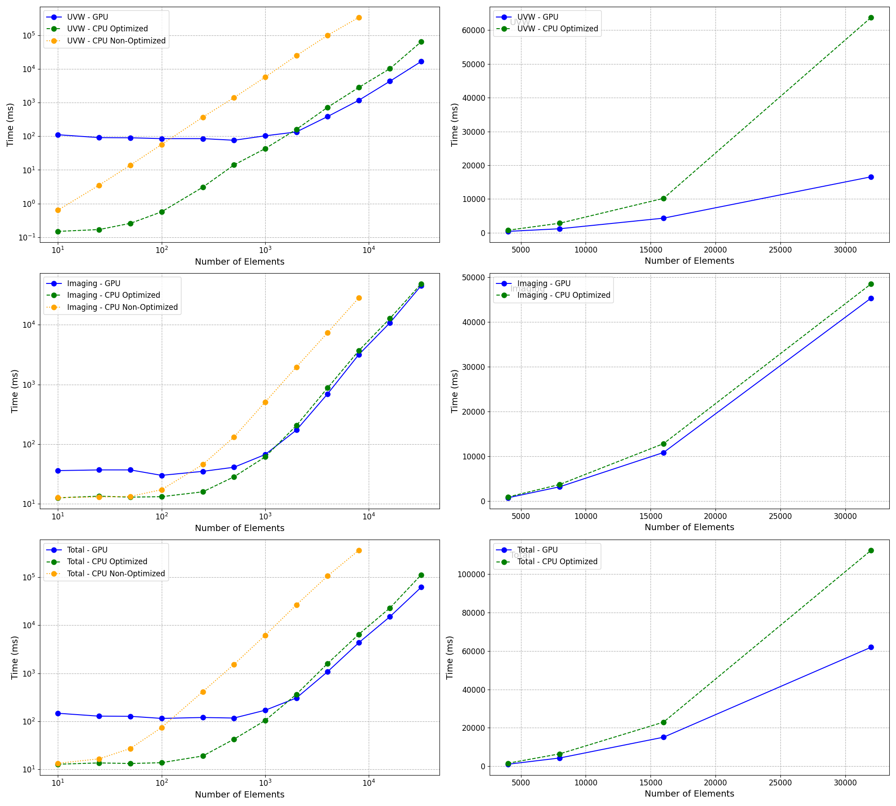

# RadioImagerGPU

...

## Overview

...
## Configuration

The `config.json` file is used to configure key parameters for the `RadioImager` program. This file should be located in the root directory of the repository. The configuration parameters include:

- `IMAGE_SIZE`: The size of the output image in pixels.
- `PREDEFINED_MAX_UV`: The predefined maximum UV distance parameter.

Example `config.json`:
```json
{
    "IMAGE_SIZE": 256,
    "PREDEFINED_MAX_UV": 4000.0
}
```

## System Requirements

To fully utilize the GPU acceleration capabilities, ensure you have a compatible NVIDIA GPU. Below is the hardware and software setup used for developing and testing this project:

### Operating System
- **OS:** Ubuntu 22.04.4 LTS (Jammy)
- **Kernel:** Linux 6.5.0-28-generic

### NVIDIA Driver and GPU
- **Driver Version:** 550.54.15
- **CUDA Version:** 12.4
- **GPUs:**: NVIDIA GeForce GTX TITAN X (2 units, 12 GB each)

### CUDA Toolkit
- **Version:** CUDA 12.4

### Python Environment
- **Python Version:** 3.10.12
- The required Python packages are listed in `requirements.txt`.


### Installation and Building the Project

Clone the repository and navigate to the project directory:

```bash
git clone --recurse-submodules https://github.com/nkosogor/RadioImagerGPU.git
cd RadioImagerGPU
pip install -r requirements.txt
```
Use CMake to configure and build the project:

```bash
mkdir build
cd build
cmake ..
make
```

##  GPU Implementation

### How to Execute

After building the project, you can execute the `RadioImager` using the following command from the `build` directory:
```bash
./build/RadioImager [OPTIONS]
```

### What the Code Does

The `RadioImager` program computes UVW coordinates from XYZ coordinates, performs imaging using GPU acceleration, and saves the resulting images and coordinates.

### Options

The following options can be provided to the `RadioImager` program:

- `--input`: Path to the input CSV file with XYZ coordinates. Default: `data/xyz_coordinates.csv`
- `--directions`: Path to the directions CSV file with Hour Angles (HAs) and Declinations (Decs). Default: `data/directions.csv`
- `--use_predefined_params`: Use predefined UVW parameters. Default: `true`
- `--output_uvw`: Output UVW coordinates. Default: `true`
- `--uvw_dir`: Directory to save UVW coordinates. Default: `data/uvw_coordinates`
- `--image_dir`: Directory to save images. Default: `data/images_gpu`
- `--save_images`: Save images. Default: `true`

### Example Command

```bash
./build/RadioImager --input custom_data/xyz_coordinates.csv --directions custom_data/directions.csv --use_predefined_params false --output_uvw true --uvw_dir output/uvw --image_dir output/images --save_images true
```

This command will use custom input files, disable predefined UVW parameters, output UVW coordinates to the specified directory, and save images to the specified directory.

## CPU Implementation

### How to Execute

To run the CPU implementation, execute the `imaging_cpu.py` script from the `python` directory:
```bash
python3 python/imaging_cpu.py [OPTIONS]
```

### What the Code Does

The `imaging_cpu.py` script computes UVW coordinates from XYZ coordinates, performs imaging using CPU processing, and saves the resulting images and coordinates.

### Options

The following options can be provided to the `imaging_cpu.py` script:

- `--input`: Path to the input CSV file with XYZ coordinates. Default: `data/xyz_coordinates.csv`
- `--directions`: Path to the directions CSV file with Hour Angles (HAs) and Declinations (Decs). Default: `data/directions.csv`
- `--use_predefined_params`: Use predefined UVW parameters. Default: `true`
- `--image_dir`: Directory to save images. Default: `data/images`
- `--uvw_dir`: Directory to save UVW coordinates. Default: `data/uvw_coordinates`
- `--optimized`: Use optimized implementation. Default: `true`
- `--save_uvw`: Save UVW coordinates to CSV. Default: `true`
- `--generate_images`: Generate and save images. Default: `true`
- `--save_im`: Save images (default: true)
- `--save_as_csv`: Additionally save images as CSV files apart from PNG. Default: `true`


### Optimized vs. Non-Optimized Implementation

#### Optimized Implementation
The optimized implementation leverages NumPy's broadcasting and vectorized operations to efficiently compute the UVW coordinates and map visibilities to a grid. This approach minimizes the use of explicit loops and takes advantage of NumPy's internal optimizations for array operations, resulting in significant performance improvements, especially for large datasets.

- **UVW Computation**: 
  - Uses broadcasting to compute the differences between XYZ coordinates.
  - Calculates UVW coordinates for all baselines.
  - Masks and flattens arrays to select relevant baselines.
- **Visibility Mapping**:
  - Uses vectorized operations to compute grid indices.
  - Employs `np.add.at` to accumulate visibilities on the grid efficiently.

#### Non-Optimized Implementation
The non-optimized implementation uses explicit loops to compute UVW coordinates and map visibilities to a grid. While this approach is straightforward and easier to understand, it is significantly slower for large datasets due to the overhead of Python loops and the lack of vectorized operations.

- **UVW Computation**:
  - Uses nested loops to compute the differences between XYZ coordinates for each pair of antennas.
  - Calculates UVW coordinates for each baseline individually.
- **Visibility Mapping**:
  - Uses loops to compute grid indices and accumulate visibilities.
  
### Example Command
```bash
python3 python/imaging_cpu.py --input custom_data/xyz_coordinates.csv --directions custom_data/directions.csv --use_predefined_params false --image_dir output/images --uvw_dir output/uvw --optimized false --save_uvw true --generate_images true --save_im true --save_as_csv true
```

This command will use custom input files, disable predefined UVW parameters, output UVW coordinates to the specified directory, and save images to the specified directory together with saving them as CSV files.


## Running Tests

To run the tests and compare images generated by CUDA and Python implementations, execute the following script from the root of the project:

```bash
python3 tests/compare_images.py
```

For detailed information about the tests, refer to [Tests README](tests/README.md).


## Analysis

This part presents the performance analysis of UVW and Imaging computations using GPU and CPU implementations (both optimized and non-optimized). The plots below compare the computation times across different numbers of elements using a log scale for UVW, Imaging, and Total computation times. Additionally, the right-hand plots provide a linear scale view for number of elements greater than 2000.


### Performance Comparison

<picture>
  <source media="(prefers-color-scheme: dark)" srcset="analysis/performance_comparison_combined_dark.png">
  <source media="(prefers-color-scheme: light)" srcset="analysis/performance_comparison_combined_light.png">
  
</picture>

### Observations

The GPU outperforms both the optimized and non-optimized CPU implementations for a large number of elements, though it is slower for a small number of elements due to the overhead of transferring data between the host and the device. The optimized CPU implementation is much faster than the non-optimized version. The GPU is significantly faster for UVW calculations with a large number of elements, but the speedup is less pronounced for imaging calculations, likely due to the fixed grid size (image size of 512 was used). Even so, the GPU remains slightly faster than the optimized CPU for imaging, which can still be beneficial in reducing computation time.


