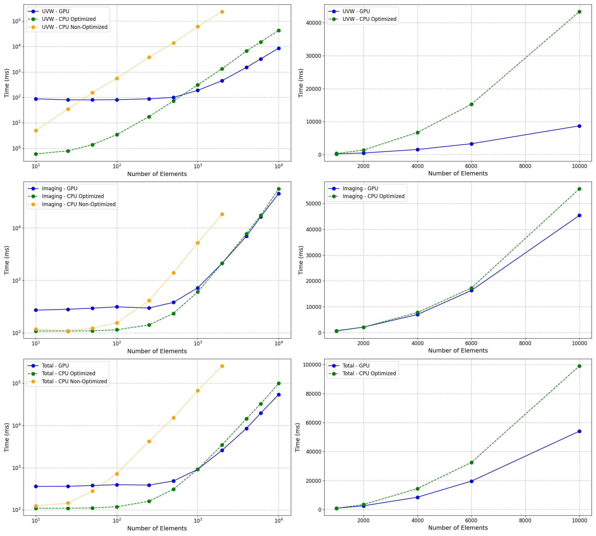

# RadioImagerGPU

## Description and Overview

This project, RadioImagerGPU, focuses on developing a GPU-accelerated imager for radio telescope arrays, optimizing the imaging process in arrays with dense UVW sampling. By leveraging the parallel processing capabilities of GPUs, this project aims to enhance the efficiency and performance of radio imaging, potentially simplifying the imaging pipeline and reducing the reliance on complex deconvolution algorithms.

## Introduction

Radio telescopes capture data known as visibilities, which are the Fourier transform of the sky's brightness distribution. Processing this data involves complex calculations that can be computationally intensive, especially for large datasets. Traditional CPU-based methods often struggle with the high computational load, leading to slower processing times.

GPUs, with their ability to perform parallel processing, are well-suited for handling these intensive computations. They can efficiently manage the gridding of visibilities, apply complex weighting schemes, and perform fast Fourier transforms (FFTs). This makes GPUs ideal for enhancing the speed and efficiency of radio imaging processes, allowing for real-time imaging and handling larger datasets with higher precision.

Additionally, the project involves calculating UVW coordinates from XYZ positions of the antennas. The visibility function is calculated using an integral that accounts for the brightness distribution of the sky as a function of celestial coordinates and spatial frequency coordinates.

By optimizing these computations using GPU acceleration, RadioImagerGPU aims to provide a more efficient and scalable solution for radio telescope imaging.


## System Requirements

To fully utilize the GPU acceleration capabilities, ensure you have a compatible NVIDIA GPU. Below is the hardware and software setup used for developing and testing this project:

### Operating System
- **OS:** Ubuntu 22.04.4 LTS (Jammy)
- **Kernel:** Linux 6.5.0-28-generic

### NVIDIA Driver and GPU
- **Driver Version:** 550.54.15
- **CUDA Version:** 12.4
- **GPUs:**: NVIDIA GeForce GTX TITAN X (2 units, 12 GB each)

### CUDA Toolkit
- **Version:** CUDA 12.4

### Python Environment
- **Python Version:** 3.10.12
- The required Python packages are listed in `requirements.txt`.


### Installation and Building the Project

Clone the repository and navigate to the project directory:

```bash
git clone --recurse-submodules https://github.com/nkosogor/RadioImagerGPU.git
cd RadioImagerGPU
pip install -r requirements.txt
```
Use CMake to configure and build the project:

```bash
mkdir build
cd build
cmake ..
make
```
## Configuration

The `config.json` file is used to configure key parameters for the `RadioImager` program. This file should be located in the root directory of the repository. The configuration parameters include:

- `IMAGE_SIZE`: The size of the output image in pixels.
- `PREDEFINE_MAX_UV`: The predefined maximum UV distance parameter essentially makes the resolution of the final images predefined and not dependent on the calculated UV coordinates when the corresponding option is enabled.


## GPU Implementation

One can run the GPU-accelerated imager from the root of the repository with:
```bash
./build/RadioImager [OPTIONS]
```
For detailed GPU implementation instructions, please refer to the [src/README.md](src/README.md).

## CPU Implementation

To run the CPU version from the root of the repository, use:
```bash
python3 python/imaging_cpu.py [OPTIONS]
```
For detailed CPU implementation instructions, please refer to the [python/README.md](python/README.md).

## Running Tests

To run the tests and compare images generated by CUDA and Python implementations, execute the following script from the root of the project:

```bash
python3 tests/compare_images.py
```

For detailed information about the tests, refer to [Tests README](tests/README.md).

## Analysis

The GPU-accelerated RadioImager shows improvements compared to the CPU implementation. Below is an example of a performance comparison with different numbers of arrays (elements) in the case of 10 directions. The plots on the left show a log scale, and on the right, a linear scale. The GPU outperforms the optimized CPU version, which uses vectorized NumPy operations, for different parts of the calculation (UVW, Imaging, and Total times). For a more detailed description of the results, please refer to the [analysis/README.md](analysis/README.md).


### Performance Comparison

<picture>
  <source media="(prefers-color-scheme: dark)" srcset="analysis/performance_comparison_num_directions_10_dark.png">
  <source media="(prefers-color-scheme: light)" srcset="analysis/performance_comparison_combined_light.png">
  
</picture>


## Documentation

Apart from the aforementioned READMEs, additional documentation is available in the `docs` directory as HTML files, which were generated with Doxygen and the Doxyfile. These can be examined either in the `docs` directory.

## Additional Notes

This is a toy imager that needs to be updated to be used in practical real-world scenarios. Some features that can be added for that include:

- **Acceptance of Arbitrary Visibilities**: Currently, all visibilities are set to 1, so the final image effectively looks like a PSF. Allowing for arbitrary visibilities would make the imager more versatile.
- **Addition of W-Projection**: For wider fields of view or directions where w-terms become significant, adding w-projection would improve image accuracy.


