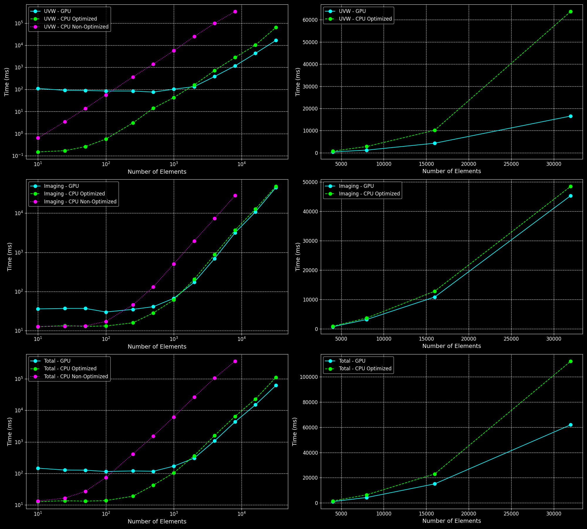
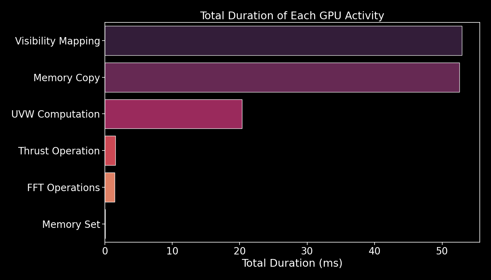

# Analysis

This part presents the performance analysis of UVW and Imaging computations using GPU and CPU implementations (both optimized and non-optimized). The plots below compare the computation times across different numbers of elements using a log scale for UVW, Imaging, and Total computation times. Additionally, the right-hand plots provide a linear scale view for the number of elements where GPU starts to become better than optimized CPU.

## Performance Comparison

### Different Numbers of Directions

#### 1 Direction

The performance comparison for 1 direction shows that the GPU implementation starts to outperform the optimized CPU implementation as the number of elements increases. However, for a smaller number of elements, the overhead of data transfer makes the GPU slower.



#### 5 Directions

For 5 directions, the GPU shows more consistent improvements over the CPU implementations. The parallelization benefits of the GPU become more pronounced, making it significantly faster for larger numbers of elements.


#### 10 Directions

Same as for 5 directions but even more pronounced.


### Observations

- **Large Number of Elements**: The GPU outperforms both the optimized and non-optimized CPU implementations for a large number of elements. However, it is slower for a small number of elements due to the overhead of transferring data between the host and the device.
- **Optimized vs. Non-Optimized**: Both the optimized CPU and GPU implementations are much faster than the non-optimized versions.
- **UVW Calculations**: The GPU is significantly faster for UVW calculations with a large number of elements.
- **Imaging Calculations**: The speedup for imaging calculations is less pronounced, likely due to the fixed grid size (image size of 512) when dealing with a small number of directions.
- **Parallelization Benefits**: For larger batches of directions (around 10), GPU improvements become more pronounced due to parallelization of multiple directions.
- **Large Number of Directions**: For a very large number of directions (around 100), transferring data between the host and the device becomes a bottleneck, and the GPU performance is worse compared to the CPU.


## Visual Analysis

Below is a video showing how different numbers of arrays (elements) affect the resulting image (images are shown for different directions). One can use the GPU-accelerated software to quickly test their PSFs for different array configurations, observational directions, and potential artifact identification.

[Watch the video](analysis/images_evolution_dark.mp4)


## GPU Activity Duration

The NVIDIA profiler was used on the GPU-accelerated software with the following command:

```bash
nvprof ./build/RadioImager [OPTIONS]
```

This run was performed with 2000 elements and 5 directions. The resulting image below shows the total duration of each GPU activity:




- **Visibility Mapping**: Mapping visibility data onto a grid.
- **Memory Copy**: Transferring data between host and device memory.
- **UVW Computation**: Calculating UVW coordinates from XYZ coordinates.
- **Thrust Operation**: Performing operations using Thrust library.
- **FFT Operations**: Executing Fast Fourier Transforms.
- **Memory Set**: Initializing and setting memory values.

## CSV Data

The performance data is provided in CSV files, `gpu_timings.csv` and `cpu_timings.csv`. Below is the format of these files (all times are in ms):

### GPU Timings

| num_elements | num_directions | uvw_time | imaging_time |
|--------------|----------------|----------|--------------|
| 10           | 1              | 111      | 36           |
| 25           | 1              | 91       | 37           |
| ...          | ...            | ...      | ...          |

### CPU Timings

| num_elements | num_directions | optimization   | uvw_time | imaging_time |
|--------------|----------------|----------------|----------|--------------|
| 10           | 1              | optimized      | 0.15     | 12.61        |
| 10           | 1              | non-optimized  | 0.64     | 12.70        |
| ...          | ...            | ...            | ...      | ...          |

